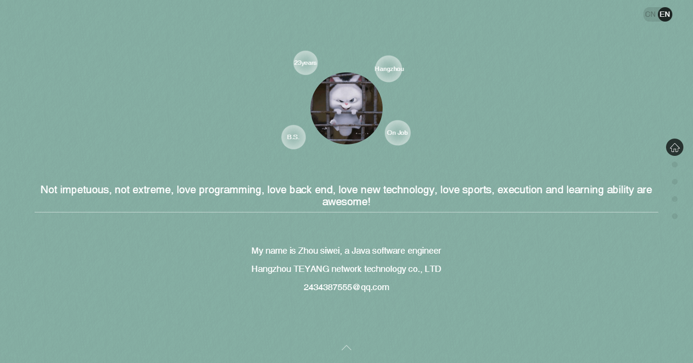
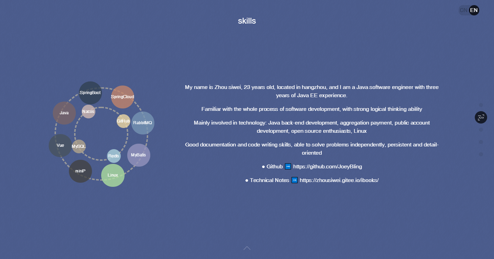
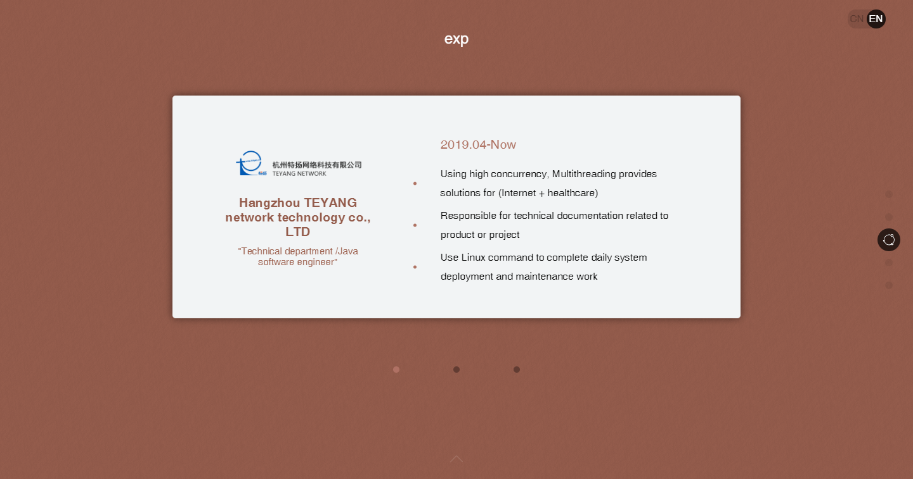
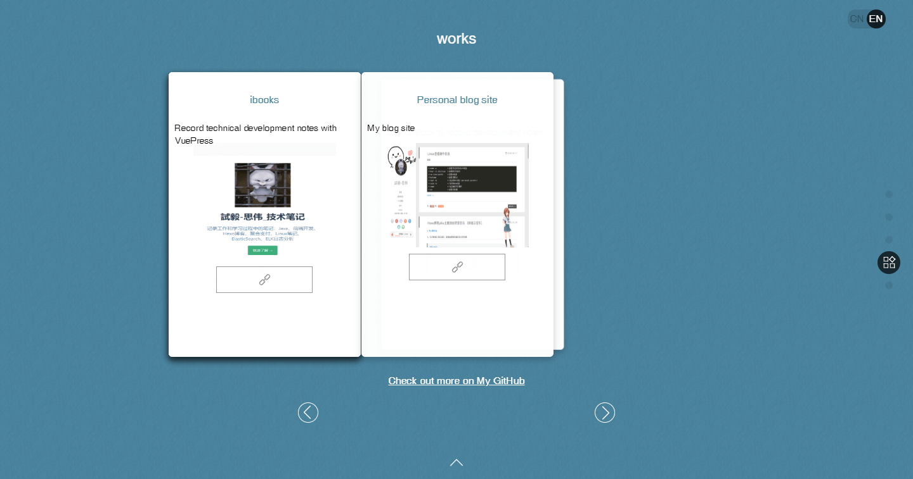
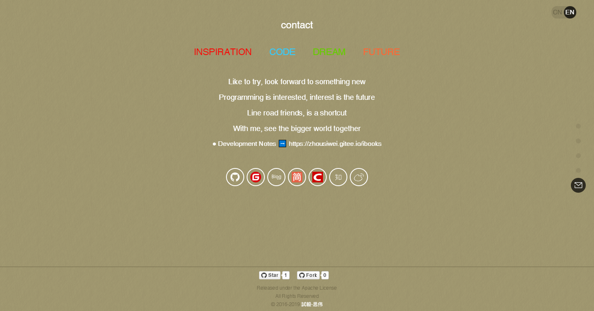

## [Resume of Java Software Engineer](https://joeybling.github.io/cv/)

- English | [中文](README.md)

> **Welcome to Use And Star project support，If encounter a problem in using process，You can put forward Issue，I will try my best to perfect it.**

## Introduction
- Function is still very few, welcome to give me Suggestions and Suggestions ~
- **This project originated from：[https://github.com/zhaoky/flqin](https://github.com/zhaoky/flqin "https://github.com/zhaoky/flqin")。Great respect to the author。**

## Online Preview

> **Preview ➡️ [https://joeybling.github.io/cv/](https://joeybling.github.io/cv/)**

## Project Screenshots

[](https://joeybling.github.io/cv/ "zhousiwei's resume")
[](https://joeybling.github.io/cv/ "zhousiwei's resume")
[](https://joeybling.github.io/cv/ "zhousiwei's resume")
[](https://joeybling.github.io/cv/ "zhousiwei's resume")
[](https://joeybling.github.io/cv/ "zhousiwei's resume")

## Local Preview
1. Install `node.js/npm`
> Refer to My Article ➡️ [Linux或Win下安装node和npm](https://www.jianshu.com/p/f8b0a4f7a822)

2. Run
```bash
npm install
npm run dev
```

## Compile
```bash
npm run build   //or `yarn run build`
```

## Project support

### [@korey/MVVM](https://github.com/zhaoky/mvvm)

> A simple MVVM framework, which currently implements the functions of data-binding and view-refresh, is still being optimized and updated. Welcome to learn and exchange ideas.

### [@korey/Fullpage](https://github.com/zhaoky/fullpage)

> A simple Fullpage framework, the current implementation of up and down, pulley rolling, direct anchor full-screen page-turning function, is still continuing to optimize and update, welcome to learn exchange.


**Always trying, never giving up**
> Not impetuous, not radical, not conservative, love programming, love the back end, love new technology, love sports, love travel, execution and learning ability are awesome!

# About Me
- [Personal blog](https://zhousiwei.gitee.io/)
- [Opensource Project](https://zhousiwei.gitee.io/ibooks/opensource)
- [GitHub](https://github.com/JoeyBling)
- [Gitee](https://gitee.com/zhousiwei)
- [notes](https://www.jianshu.com/u/02cbf31a043a)
- [CSDN](https://blog.csdn.net/qq_30930805)
- [zhihu](https://www.zhihu.com/people/joeybling)
- [weibo](http://weibo.com/jayinfo)
- **Major Technology：`Java`、`Third Party Pay`、`Wechat_Mp`、`Open Source Enthusiasts`、`Linux`**

## License

[Apache License](./LICENSE)
